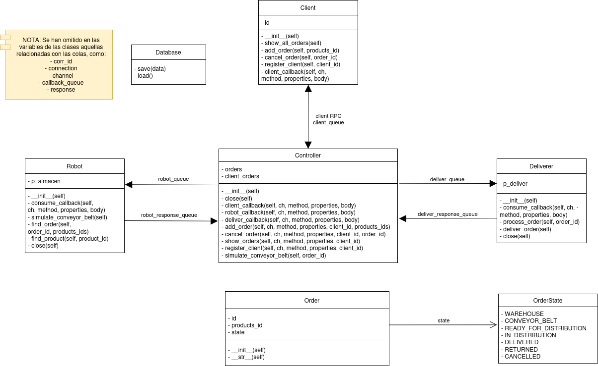
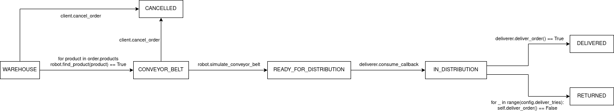
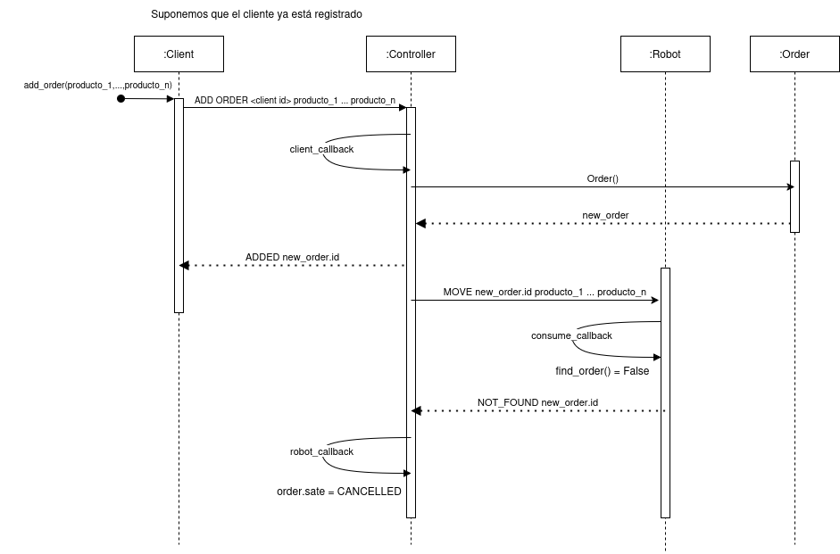
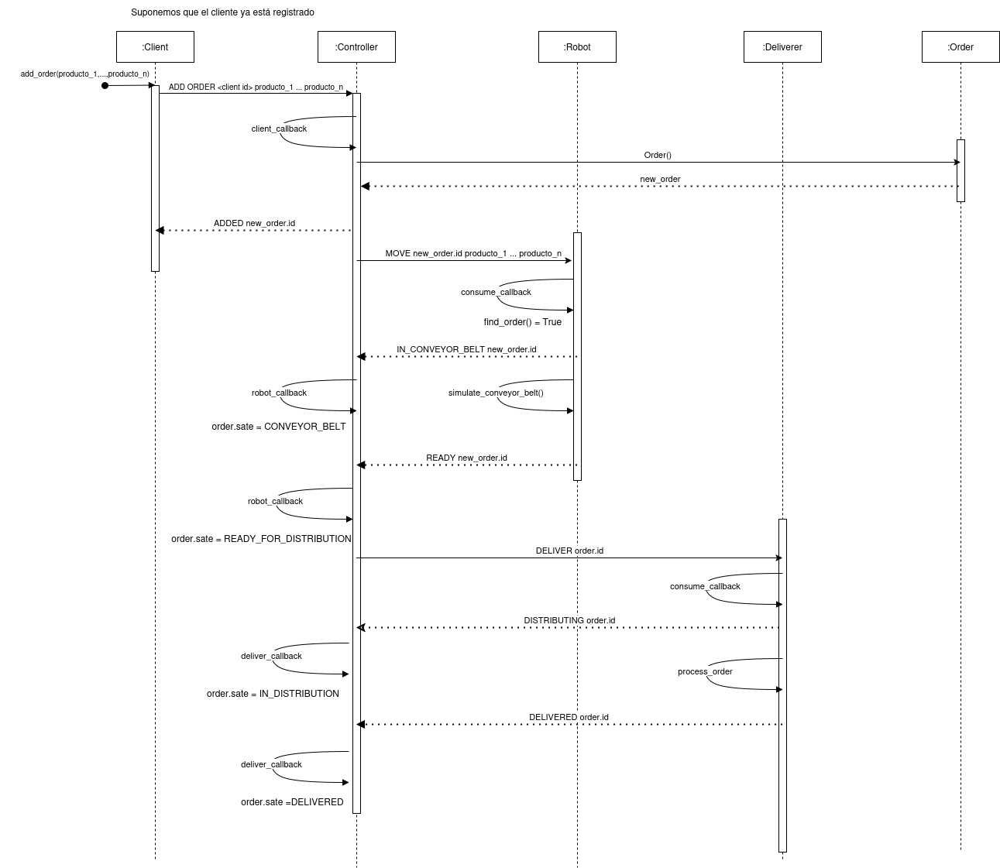
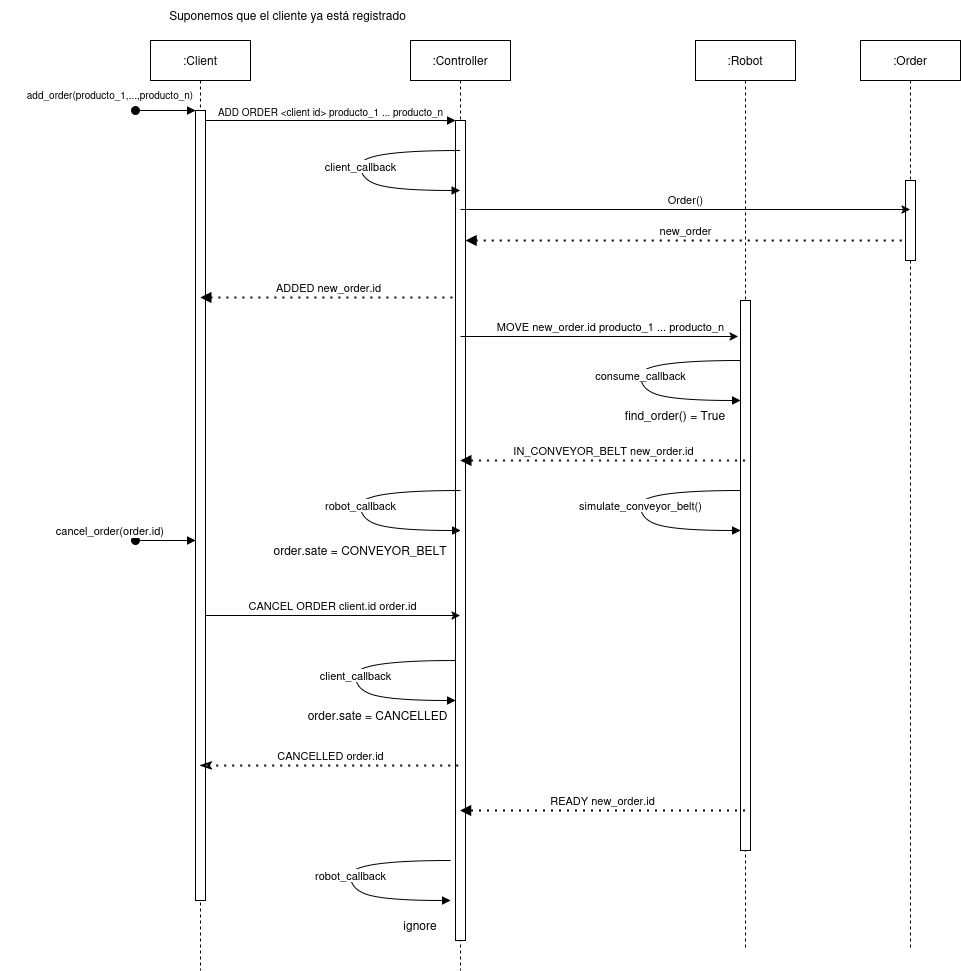

# Índice
1. [Introdución](#Introducción)
2. [Definición del proyecto](#Definicion)
3. [Implementación](#Implementación)
3. [Conclusiones](#Conclusiones)


# 1. Introducción
El objetivo de Saimazoom es el de crear un sistema para la gestión de pedidos online. Este sistema debe incluir a los actores:
* **Cliente**, que realiza y gestiona pedidos de productos.
* **Controlador** central, que gestiona todo el proceso.
* **Robots**, que se encargan de buscar los productos en el almacén y colocarlos en las cintas transportadoras.
* **Repartidores**, encargados de transportar el producto a la casa del cliente
* **Admin** encargados de gestionar la base de datos del controlador central

El sistema debe de gestionar las interacciones entre todos estos actores, para las comunicaciones correspondientes se empleará una cola de mensajes.


# 2. Definición del proyecto
El sistema Saimazoom, como conjunto, debe gestionar pedidos, en los que los **clientes** pueden solicitar un producto. Una vez recibido un pedido, el **controlador** debe avisar a un **robot**, que mueve dicho producto del almacén a la cinta transportadora. Una vez en la cinta transportadora, el controlador avisa a un **repartidor**, que lleva el producto a la casa del **cliente**. 
<!-- Las comunicaciones pertinentes entre estos elementos estarán gestionadas por un **controlador** central, que mantiene la comunicación entre los **clientes**, **robots** y **repartidores**. -->

## 2.1. Objetivos y funcionalidad
Los objetivos principales son: 
* La gestión de los pedidos de los **clientes**, que pueden hacer, ver  y cancelar pedidos.
* La gestión de los **robots**, que reciben ordenes de de transportar los productos del almacen a la cinta transportadora.
* La gestión de los **repartidores**, que reparten los productos que hay en la cinta transportadora a la casa de los clientes.
* La gestión del **controlador** central, que tiene que mantener un control de productos, **clientes**, **robots** y **repartidores**. Tiene que guardar también los pedidos, con sus estados, que dependen de la relación con el resto de actores.
* La comunicación entre el **controlador** y el resto de actores

Para cumplir estos objetivos es necesario desarrollar una serie de funcionalidades básicas:
1. Registro de **Cliente**: registro desde una petición de un **Cliente** con un identificador de **cliente** que tiene que ser único.
2. Registro de Pedido: registro en la base de datos del **controlador** central con un id de **cliente** y de producto, también le asigna un estado al pedido.
3. Recepción de pedidos de los **Clientes**: hay que recibir y guardar los pedidos a realizar que están asociados a un **Cliente** y a un producto.
4. Asignación de trabajo a los **Robots**: hay que asignar a los **robots** las tareas de transporte de productos correspondientes a pedidos.
5. Asignación de trabajo a los **Repartidores**: hay que asignar a los **repartidores** las tareas de transporte de productos correspondientes a pedidos.

## 2.2. Requisitos
Nos limitaremos a los requisitos funcionales, estos los podemos dividir en los siguientes apartados:

### 2.2.1. **Lógica de clientes**
**LoCl1**. Los clientes tienen acceso a una aplicación de consola mediante la que pueden interactuar con el sistema.  
**LoCl2**. Los clientes pueden Registrarse en la aplicación en la que se recibe confirmación.  
**LoCl3**. Los clientes pueden realizar un pedido, en el que se pide un producto.  
**LoCl4**. Los clientes pueden pedir una lista de los pedidos realizados en la que se incluya id del producto correspondiente al pedido y estado del pedido.  
**LoCl5**. Los clientes pueden pedir la cancelación de un pedido. Sólo se permite antes de que el pedido haya empezado a ser tramitado por un repartidor.  

### 2.2.2 **Lógica de Controlador**
**LoCo1**. El controlador puede gestionar los pedidos controlando el estado de cada pedido.  
**LoCo2**. El controlador puede gestionar los clientes llevando un registro de los mismos y sus pedidos.  
**LoCo3**. El controlador puede gestionar las colas de comunicación entre los actores del sistema.  
**LoCo4**. El controlador debe persistir su estado en todo momento.  

### 2.2.3 **Lógica de robots**
**LoRo1**. Los robots escuchan la cola de mensajes del servidor.  
**LoRo2**. Los robots pueden buscar un producto en el almacen.  
**LoRo3**. Los robots pueden mover el producto del almacen a la cinta transportadora.  
**LoRo4**. Los robots pueden comunicar al controlador la finalización del trabajo indicando si ha sido exitosa o si no. 

### 2.2.4 **Lógica de repartidores**
**LoRe1**. Los repartidores pueden llevar el pedido al domicilio del cliente con un máximo de tres intentos.  
**LoRe2**. Los reparetidores comunican al controlador el estado del reparto.  

### 2.2.5 **Lógica de pedidos**
**LoPe1**. Los pedidos se pueden cancelar siempre y cuando se encuentren en las instalaciones de Saimazoom.  
**LoPe2**. Cada pedido tiene uno de los siguientes estados: almacén, en cinta, en reparto, entregado.   


# 3. Implementación

La implementación del proyecto Saimazoom se ha desarrollado utilizando el lenguaje de programación Python, siguiendo un enfoque orientado a objetos. Las principales clases diseñadas son: `Controller`, `Robot`, `Client`, `Order` y `Deliverer`, junto con sus respectivos lanzadores. A continuación, se detalla la funcionalidad de cada componente:

## Clase `Controller`

La clase `Controller` gestiona la interacción entre clientes, pedidos y colas de mensajes en un sistema distribuido. Sus principales características son:

### Atributos
- **`orders`**: Diccionario que almacena los pedidos (`Order`) identificados por un ID único.
- **`clients_orders`**: Diccionario que asocia a cada cliente (`client_id`) una lista de sus pedidos.
- **`lock`**: Objeto `threading.Lock` para manejar la concurrencia al modificar datos compartidos.
- **`connection`**: Conexión al servidor de mensajería (RabbitMQ) utilizando la librería `pika`.
- **`channel`**: Canal de comunicación para enviar y recibir mensajes en las colas de RabbitMQ.

### Colas de Mensajes
- **`client_queue`**: Cola para recibir mensajes de los clientes.
- **`robot_queue`** y **`robot_response_queue`**: Colas para interactuar con los robots.
- **`deliver_queue`** y **`deliver_response_queue`**: Colas para interactuar con los repartidores.

### Métodos Principales
1. **`__init__`**: Inicializa el controlador, carga datos desde la base de datos y configura las colas de mensajes.
2. **`close`**: Guarda el estado actual del sistema en la base de datos y cierra el controlador.
3. **Callbacks**: Procesan mensajes recibidos en las colas:
    - **`client_callback`**: Gestiona comandos de clientes como `ADD`, `CANCEL`, `SHOW` y `REGISTER`.
    - **`robot_callback`**: Procesa actualizaciones de los robots sobre el estado de los pedidos.
    - **`deliver_callback`**: Gestiona notificaciones de los repartidores sobre el estado de las entregas.
4. **Gestión de Pedidos**:
    - **`add_order`**: Añade un nuevo pedido y lo asigna a un robot.
    - **`cancel_order`**: Cancela un pedido si cumple con las condiciones establecidas.
    - **`show_orders`**: Muestra los pedidos asociados a un cliente.
    - **`register_client`**: Registra un nuevo cliente o permite iniciar sesión.

5. **`simulate_conveyor_belt`**: Simula el tiempo que un pedido pasa en la cinta transportadora.

---

## Clase `Client`

La clase `Client` representa a un cliente que interactúa con el sistema distribuido a través de RabbitMQ. Permite registrar usuarios, realizar pedidos, cancelarlos y consultar su estado.

### Atributos
- **`id`**: Identificador único del cliente, inicializado como `-1` (no registrado).
- **`connection`**: Conexión con RabbitMQ.
- **`channel`**: Canal de comunicación con RabbitMQ.
- **`callback_queue`**: Cola temporal para recibir respuestas del servidor.
- **`response`**: Almacena la respuesta del servidor.
- **`corr_id`**: Identificador único de correlación para asociar solicitudes y respuestas.

### Métodos Principales
1. **`__init__`**: Inicializa el cliente y configura la conexión con RabbitMQ.
2. **`add_order(products_id)`**: Envía una solicitud para agregar un pedido.
3. **`cancel_order(order_id)`**: Solicita la cancelación de un pedido específico.
4. **`show_all_orders()`**: Consulta todos los pedidos asociados al cliente.
5. **`register_client(client_id)`**: Registra al cliente en el sistema.
6. **`client_callback`**: Procesa las respuestas recibidas en la cola temporal.

---

## Clase `Deliverer`

La clase `Deliverer` simula el comportamiento de un repartidor encargado de procesar tareas de entrega de pedidos.

### Atributos
- **`connection`**: Conexión con RabbitMQ.
- **`channel`**: Canal de comunicación con RabbitMQ.

### Métodos Principales
1. **`__init__`**: Configura las colas necesarias para recibir tareas y enviar respuestas.
2. **`consume_callback`**: Procesa mensajes de entrega recibidos en la cola de tareas.
3. **`process_order(order_id)`**: Intenta entregar un pedido con un máximo de tres intentos.
4. **`deliver_order()`**: Simula el proceso de entrega de un pedido.
5. **`close()`**: Cierra de forma segura la conexión con RabbitMQ.

---

## Clase `Order`

La clase `Order` representa un pedido en el sistema.

### Atributos
- **`id`**: Identificador único del pedido.
- **`products_id`**: Lista de identificadores de productos asociados al pedido.
- **`state`**: Estado actual del pedido, definido mediante el enumerador `OrderState`.

### Métodos
1. **`__init__`**: Inicializa los atributos del pedido.
2. **`__str__`**: Devuelve una representación en cadena del pedido.

---

## Enumerador `OrderState`

El enumerador `OrderState` define los posibles estados de un pedido:
- **`WAREHOUSE`**: Pedido en el almacén.
- **`CONVEYOR_BELT`**: Pedido en la cinta transportadora.
- **`READY_FOR_DISTRIBUTION`**: Pedido listo para distribución.
- **`IN_DISTRIBUTION`**: Pedido en proceso de distribución.
- **`DELIVERED`**: Pedido entregado.
- **`RETURNED`**: Pedido devuelto.
- **`CANCELLED`**: Pedido cancelado.

---

## Clase `Robot`

La clase `Robot` simula el comportamiento de un robot encargado de procesar pedidos.

### Atributos
- **`connection`**: Conexión con RabbitMQ.
- **`channel`**: Canal de comunicación con RabbitMQ.

### Métodos Principales
1. **`__init__`**: Configura las colas necesarias para recibir tareas y enviar respuestas.
2. **`consume_callback`**: Procesa mensajes de tareas recibidos en la cola.
3. **`find_order(order_id, products_ids)`**: Busca productos asociados a un pedido en el almacén.
4. **`simulate_conveyor_belt()`**: Simula el tiempo que los productos pasan en la cinta transportadora.

---

## Sistema de Persistencia

El sistema de persistencia del controlador utiliza el módulo `pickle` para serializar y deserializar datos, permitiendo guardar y cargar el estado del sistema en un archivo.

### Uso en el Controlador
1. **Cargar Datos al Iniciar**: Recupera el estado previo del sistema al iniciar.
2. **Guardar Datos al Cerrar**: Almacena el estado actual del sistema antes de cerrar.

### Ventajas
- **Simplicidad**: Serialización de estructuras de datos complejas.
- **Recuperación de Estado**: Permite continuar desde el último estado guardado.

### Limitaciones
- **Seguridad**: `pickle` no es seguro para datos de fuentes no confiables.
- **Compatibilidad**: Los datos pueden no ser compatibles entre diferentes versiones de Python.

---

La implementación descrita asegura un sistema modular, eficiente y escalable, que gestiona de manera efectiva las interacciones entre los diferentes actores del sistema Saimazoom.

## Sintaxis y Formato de los Mensajes (RFC)

En la aplicación se manejan dos tipos principales de mensajes, cada uno con un formato y sintaxis específicos.

### Mensajes de Acciones

Los mensajes de acciones siguen el siguiente formato:

```txt
<verbo de acción> <parámetros del mensaje>
```

El verbo de acción, escrito en mayúsculas y en inglés, describe de manera precisa la acción a realizar. Los parámetros proporcionan la información necesaria para que el actor correspondiente pueda ejecutar la tarea, como el identificador de un pedido o de un cliente.

Por ejemplo, el mensaje:
```txt
CANCEL <order_id>
```
Indica la acción de cancelar un pedido, donde el identificador del pedido (`order_id`) es un parámetro esencial.

Los mensajes de acciones pueden describir tareas pendientes o acciones ya realizadas. Para diferenciar estos casos, se utiliza el tiempo verbal del mensaje. Los mensajes que indican tareas pendientes emplean el tiempo presente, mientras que los que describen acciones completadas utilizan el pasado simple. Por ejemplo:

```txt
CANCELLED <order_id>
```

A continuación, se enumeran todos los mensajes de acción posibles:

```txt
DELIVER <order_id>
ADDED <new order id>
MOVE <order id> <products ids>
CANCEL <order id>
CANCELLED <order id>
SHOWED <client id> <lista de orders con su info>
LOGGED_IN <client id>
REGISTERED <client id>
SHOW ORDERS <client id>
ADD ORDER <client id> <lista de productos>
CANCEL ORDER <client id> <order id>
REGISTER CLIENT <client id>
DISTRIBUTING <order id>
DELIVERED <order id>
FAILED_DELIVERY <order_id>
IN_CONVEYOR_BELT <order id>
READY <order id>
NOT_FOUND <product id>
```

### Mensajes de Error

Los mensajes de error tienen el siguiente formato:

```txt
ERROR <descripción del error>
```

El prefijo `ERROR` permite identificar rápidamente este tipo de mensajes. La descripción del error proporciona información detallada que puede ser utilizada para registrar el incidente en los logs o para mostrar un mensaje claro al usuario, facilitando la comprensión del problema ocurrido.

A diferencia de los mensajes de acciones, en los mensajes de error no es necesario distinguir entre envío y recepción.

A continuación, se enumeran todos los mensajes de error posibles:

```txt
ERROR Unknown command <comando recibido>
ERROR Client <client id> not registered
ERROR Order <order id> not found
ERROR Order <order id> cannot be cancelled
```

## Diagrama de Clases

En el diagrama de clases se refleja las entidades que actúan en el sistema de Saimazoom, las cuales ya hemos detallado anterioirmente sus atributos y métodos.




## Diagrama de Estados de un Pedido

En el siguiente diagrama se ilustra los distintos estados por los que puede pasar un pedido y sus transiciones.



## Casos de Uso

A continuación se presentan tres diagramas de secuencia que reflejan el comportamiento de la aplicación ante diferentes escenarios.

### Pedido en el que el robot no encuentra el producto**



- **Nombre de caso de uso:** Producto no encontrado
- **Autor:** Antonio Moroño
- **Actores involucrados:** Cliente registrado, controlador, robot
- **Resumen**: Un cliente registrado realiza un pedido en el que uno de los productos no es encontrado por el robot y el controlador cancela el pedido.
- **Precondiciones:** El cliente está registrado y el producto no se encuentra en el almacén.
- **Postcondiciones:** El pedido es cancelado y el cliente recibe un mensaje de error.
- **Flujo de eventos:** Los reflejados en el diagrama
- **Clases involucradas:** `Client`, `Controller`, `Robot`, `Order`

### Pedido completado hasta el final**



- **Nombre de caso de uso:** Pedido completado
- **Autor:** Antonio Moroño
- **Actores involucrados:** Cliente registrado, controlador, robot, repartidor
- **Resumen**: Un cliente registrado realiza un pedido que es completado con éxito por el robot y el repartidor.
- **Precondiciones:** El cliente está registrado, los productos están disponibles.
- **Postcondiciones:** El pedido es entregado al cliente y el estado del pedido se actualiza a "entregado".
- **Flujo de eventos:** Los reflejados en el diagrama
- **Clases involucradas:** `Client`, `Controller`, `Robot`, `Order`, `Deliverer`

### Pedido cancelado antes de emepzar el reparto**



- **Nombre de caso de uso:** Pedido cancelado
- **Autor:** Antonio Moroño
- **Actores involucrados:** Cliente registrado, controlador, robot
- **Resumen**: Un cliente registrado realiza un pedido que es cancelado antes de que comience el reaprto.
- **Precondiciones:** El cliente está registrado y el pedido está en el almacen o en la cinta transportadora.
- **Postcondiciones:** El pedido es cancelado y el cliente recibe un mensaje de confirmación.
- **Flujo de eventos:** Los reflejados en el diagrama
- **Clases involucradas:** `Client`, `Controller`, `Robot`, `Order`


# 4. Conclusiones
El proyecto Saimazoom ha logrado implementar un sistema funcional y modular para la gestión de pedidos online, integrando de manera efectiva a los diferentes actores del sistema: clientes, controlador, robots y repartidores. A continuación, se destacan las principales conclusiones:

1. **Modularidad y Escalabilidad**:  
   La implementación orientada a objetos y la separación de responsabilidades entre las clases (`Controller`, `Client`, `Robot`, `Deliverer` y `Order`) han permitido un diseño modular. Esto facilita la escalabilidad del sistema, permitiendo agregar nuevas funcionalidades o actores sin afectar significativamente la estructura existente.

2. **Comunicación Asíncrona**:  
   El uso de RabbitMQ como sistema de colas de mensajes ha sido clave para gestionar la comunicación entre los diferentes actores. Este enfoque asegura que las tareas se procesen de manera asíncrona, mejorando la eficiencia y permitiendo que los componentes trabajen de forma independiente.

3. **Gestión de Estados**:  
   La implementación del enumerador `OrderState` ha proporcionado una forma clara y consistente de manejar los estados de los pedidos. Esto ha simplificado la lógica de negocio y ha reducido la posibilidad de errores en la gestión de los pedidos.

4. **Persistencia de Datos**:  
   El sistema de persistencia basado en `pickle` ha permitido guardar y recuperar el estado del sistema de manera sencilla. Aunque presenta limitaciones en términos de seguridad y compatibilidad, ha sido una solución adecuada para los requisitos del proyecto.

5. **Robustez y Manejo de Errores**:  
   La captura de señales del sistema en los launchers asegura un cierre controlado de los componentes, liberando recursos y evitando inconsistencias en el estado del sistema. Además, el manejo de errores en la carga de datos garantiza que el sistema pueda inicializarse incluso en caso de fallos en el archivo de persistencia.

6. **Interacción con los Actores**:  
   Los clientes, robots y repartidores interactúan con el sistema de manera eficiente, cumpliendo con los requisitos funcionales establecidos. Las funcionalidades como el registro de clientes, la gestión de pedidos y la asignación de tareas a robots y repartidores han sido implementadas con éxito.

7. **Limitaciones Identificadas**:  
   - La seguridad del sistema de persistencia basado en `pickle` podría mejorarse utilizando una base de datos más robusta y segura.
   - La simulación de procesos, como el movimiento de productos en la cinta transportadora, podría enriquecerse para reflejar escenarios más realistas.
   - La implementación actual no incluye un sistema de autenticación para los clientes, lo que podría ser una mejora futura.

8. **Potencial de Mejora**:  
   El diseño modular del sistema permite futuras extensiones, como la integración de interfaces gráficas para los clientes, la incorporación de métricas de rendimiento para los robots y repartidores, o la migración a un sistema de persistencia más avanzado.

En conclusión, Saimazoom ha cumplido con los objetivos planteados, proporcionando un sistema funcional y eficiente para la gestión de pedidos online. Su diseño modular y su enfoque en la comunicación asíncrona lo convierten en una base sólida para futuras mejoras y ampliaciones.