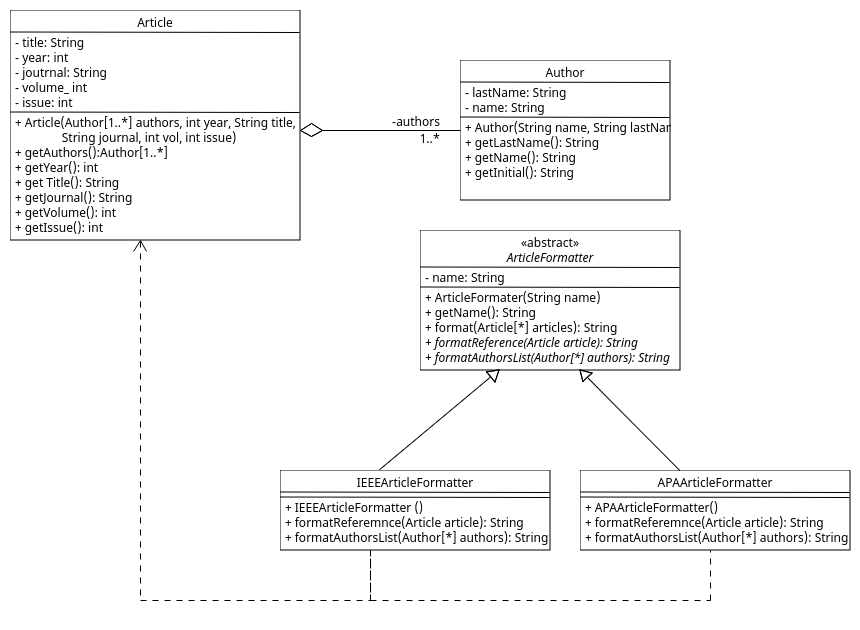

# Memoria Práctica 2

Grupo 2272: Antonio Moroño y Pedro Ismael Haddou

## Apartado 1

En cumplimiento con las directrices proporcionadas en el enunciado, se ha incorporado la subclase "IEEArticleFormatter" a la clase "ArticleFormatter". Esta adición se efectuó en respuesta a la solicitud de ampliar el diseño mediante la introducción de un método adicional para formatear los artículos. Se ha aprovechado la estructura de esta clase abstracta para extender de manera orgánica el diseño. Además, la existencia previa de una subclase de "ArticleFormatter" (APAArticleFormatter) ha servido de inspiración para la creación de una nueva subclase, específicamente diseñada para el formato requerido en la tarea asignada.

**Ejemplo de ejecucion:**

java Main
Articles in APA format:
Kaczorek, T. (2016). Minimum energy control of fractional positive electrical circuits. Archives of Electrical Engineering, 65(2).
Uchiyama, S., Kubo, A., Washizaki, H., Fukazawa, Y. (2014). Detecting Design Patterns in Object-Oriented Program Source Code by Using Metrics and Machine Learning. Journal of Software Engineering and Applications, 7(12).

Articles in IEEE format:
T. Kaczorek, "Minimum energy control of fractional positive electrical circuits", Archives of Electrical Engineering, vol. 65, no. 2, 2016.
S. Uchiyama, A. Kubo, H. Washizaki, Y. Fukazawa, "Detecting Design Patterns in Object-Oriented Program Source Code by Using Metrics and Machine Learning", Journal of Software Engineering and Applications, vol. 7, no. 12, 2014.

