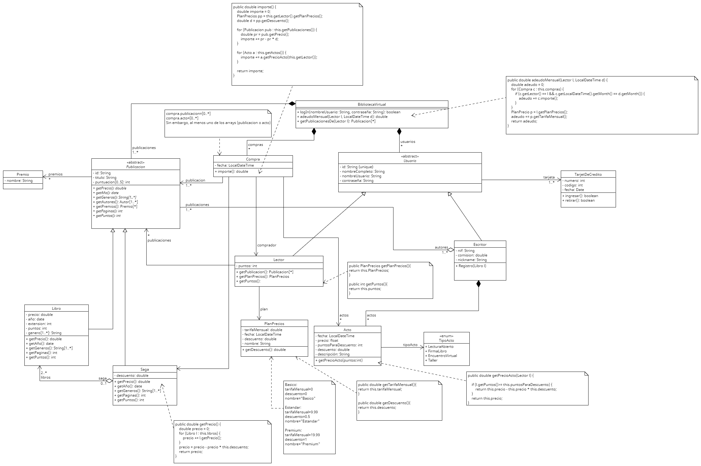

# Apartado 2
Por Pedro Ismael Haddou y Antonio Moroño.
## Diagrama de clases

En nuestro diagrama, la biblioteca virtual se compone de tres clases principales: "Publicación" (abstracta), "Usuario" (abstracta) y "Compra". La clase "Publicación" tiene una cardinalidad mínima de 1, lo que implica que siempre hay al menos una publicación en la biblioteca. Las publicaciones se dividen en dos subclases: "Libros" y "Sagas", esta última con al menos dos libros. Además, la clase "Publicación" está asociada con la clase "Premio", con una cardinalidad de cero o más premios por publicación. Por otro lado, la clase "Usuario" puede ser "Lector" o "Escritor", ambas con una o más tarjetas de crédito asociadas. Un escritor tiene al menos una publicación y los atributos mencionados en el enunciado, mientras que un lector tiene una o más publicaciones y la clase "Plan de Precios".

Los "Actos" están vinculados a la clase "Escritor" ya que dependen de estos. Se ha definido la enumeración "TipoActo" asociada a "Acto" para describir los diferentes tipos de actos. La clase "Compra" se ha creado para registrar las compras de publicaciones y actos por parte de un único comprador, que siempre es un lector. Para los puntos, se ha asumido que permiten reducir el precio con el correspondiente descuento, aplicable únicamente a la compra de actos. En cuanto a los métodos, se han implementado getters suficientes para calcular el importe de una compra, considerando la tarifa del cliente, los elementos adquiridos (ya sean publicaciones o actos), los puntos disponibles en caso de compra de actos y los descuentos. Además, se ha incluido el método "logIn" para permitir que los usuarios inicien sesión proporcionando su nombre de usuario y contraseña.

En resumen, la estructura del sistema virtual de la biblioteca se organiza en torno a la relación entre publicaciones, usuarios y compras, con los actos vinculados a los escritores y las transacciones de compra registradas para los lectores. Los métodos implementados facilitan la gestión de las transacciones y la interacción de los usuarios con la biblioteca virtual.