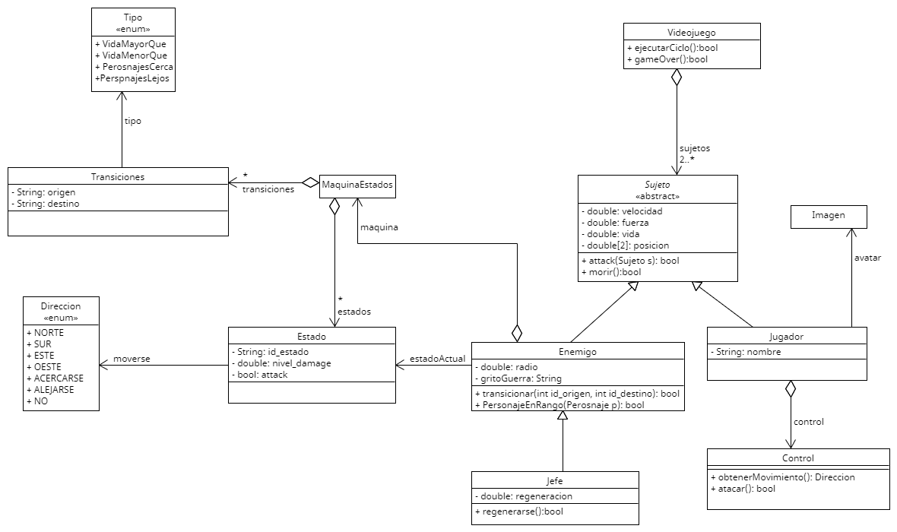
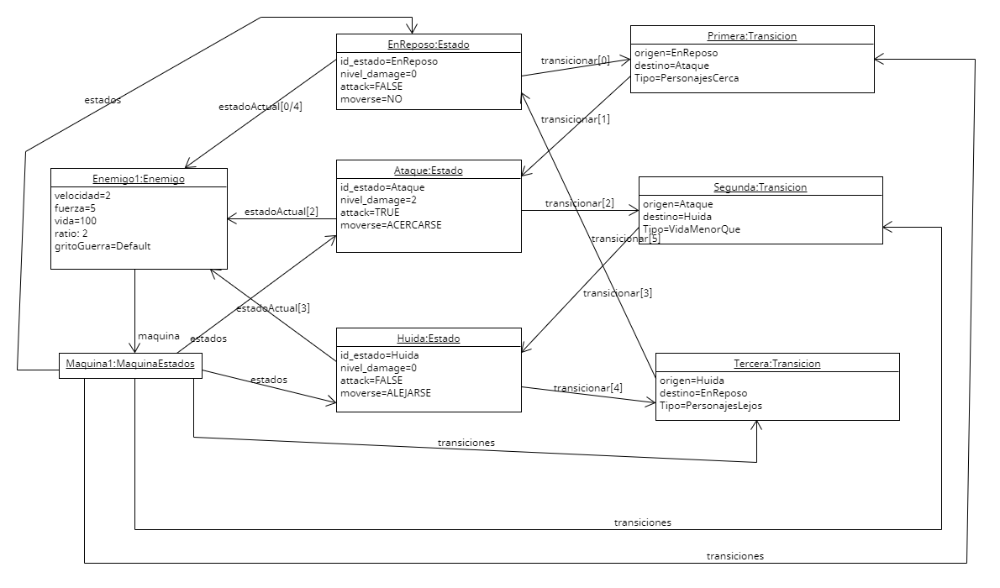

# Memoria Práctica 2

Grupo 2272: Antonio Moroño y Pedro Ismael Haddou

## Apartado 3

### Diagrama de Clases

Para materializar el diseño delineado en el enunciado, hemos optado por desarrollar una clase denominada "Videojuego" que encapsula los Sujetos que conforman dicho videojuego. La clase abstracta "Sujeto" se posiciona como la clase base de las subclases "Enemigo" y "Jugador". La clase "Jugador" incorpora tanto la clase "Control", según se describe en el enunciado, como la clase "Imagen" (dado que desconocemos la gestión de imágenes en Java).

Por otro lado, la clase "Enemigo", además de los atributos convencionales, incluye una referencia a su estado actual y actúa como la clase superior de "Jefe", la cual introduce una nueva característica en forma de un índice de recuperación de vida. Como parte del diseño, cada enemigo, tal como se especifica en el enunciado, está asociado a una máquina de estados que abarca todos los estados y transiciones posibles.

### Diagrama de Objetos

En el diagrama de objetos se representa la interacción de un enemigo, reflejando cómo se desenvuelve a través de distintos estados de acuerdo con las condiciones establecidas en el enunciado. Se observa claramente la transición fluida entre estados conforme al flujo narrado en el enunciado.